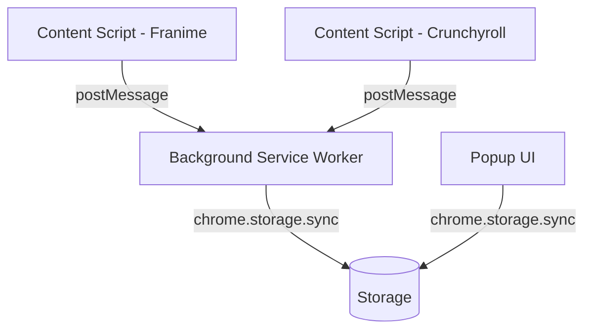

# Tsuzuku — Project Plan

> Chrome extension to track anime progress on Franime.fr and Crunchyroll.

## Goal

Automatically detect and save the anime, season, and episode currently being watched, with a popup UI to browse and manage your watch history.

---

## Supported Sites

| Site | URL |
|------|-----|
| Franime | `franime.fr` |
| Crunchyroll | `crunchyroll.com` |

---

## Features

### Core
- Auto-detect current anime title, season, and episode from the page
- Save progress on play / episode change
- Popup to view full watch list
- Mark anime as: **Watching**, **Completed**, **On Hold**, **Dropped**, **Plan to Watch**
- Edit episode/season manually

### Nice to have (v2)
- Search/filter in popup
- Last watched date
- Quick-resume button (opens last episode)
- Export watch list as JSON

---

## Architecture



### Components

| Component | Role |
|-----------|------|
| `manifest.json` | Manifest V3 config, permissions, content script bindings |
| `src/content/franime.js` | Scrapes title/season/episode on Franime |
| `src/content/crunchyroll.js` | Scrapes title/season/episode on Crunchyroll |
| `src/background.js` | Service worker, handles storage writes |
| `src/popup/` | Popup HTML + JS, displays and manages watch list |
| `src/storage.js` | Shared storage helpers |

---

## Data Model

```json
{
  "animeId": "string (slug)",
  "title": "string",
  "source": "franime | crunchyroll",
  "status": "watching | completed | on_hold | dropped | plan_to_watch",
  "season": 1,
  "episode": 12,
  "lastWatched": "2026-03-15T20:00:00Z",
  "url": "string (last episode URL)"
}
```

---

## Tech Stack

| Layer | Choice |
|-------|--------|
| Extension API | Chrome Manifest V3 |
| UI | Vanilla JS + HTML/CSS (no framework, keep it light) |
| Storage | `chrome.storage.sync` |
| Build | None initially — plain JS, add bundler if needed |

---

## Milestones

| # | Milestone | Description |
|---|-----------|-------------|
| 1 | Scaffold | Manifest, folder structure, basic popup shell |
| 2 | Crunchyroll scraper | Detect title/season/episode, save to storage |
| 3 | Franime scraper | Same for Franime |
| 4 | Popup UI | List, status badge, manual edit |
| 5 | Polish | Icons, error states, edge cases |
| 6 | v2 features | Export, quick-resume, search |
